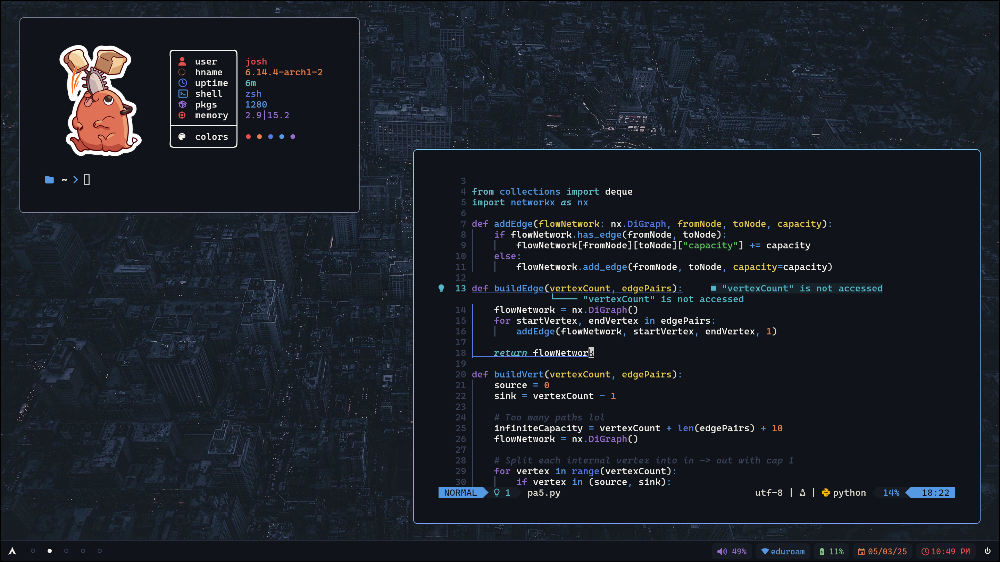
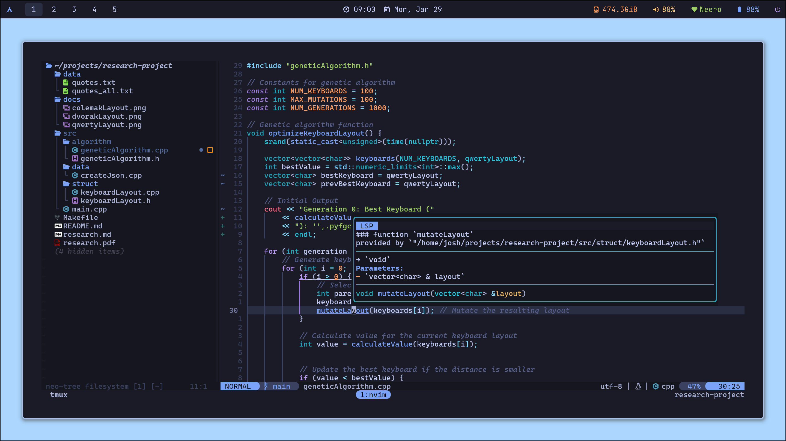

# TokyDots

A solid collection of dotfiles primarily focused around the **Tokyo Night** theme.




## Support For

- **Hyprland:** Customizable wayland compositor
- **Polybar:** A highly customizable navigation bar
- **Rofi:** Cool application launcher
- **Dunst:** Notification system
- **Kitty:** GPU Accelerated Terminal emulator
- **Tmux:** Terminal multiplexer
- **Zsh:** More capable shell (bash alternative)
- **Neovim:** Blazingly fast text editor
- **Zathura:** Document viewer

## Installation

All of these files are meant to be in the home directory

```
cd ~
git clone --recursive https://github.com/JoshuaMarkle/dotfiles.git
```

This will create a `dotfiles` directory inside of `~`. Now, just move everything out into the home directory

```
cd dotfiles
mv * ~
```

## Update Submodules

Use this command to update the sub-repos within the dotfiles

```
git submodule update --init --recursive
```

## Things to Install

```
sudo pacman -S neovim
sudo pacman -S kitty
sudo pacman -S git
sudo pacman -S zathura
sudo pacman -S tmux
sudo pacman -S fzf
sudo pacman -S spotify-launcher

yay -S pyprland
```

And you're all set! Enjoy :)
