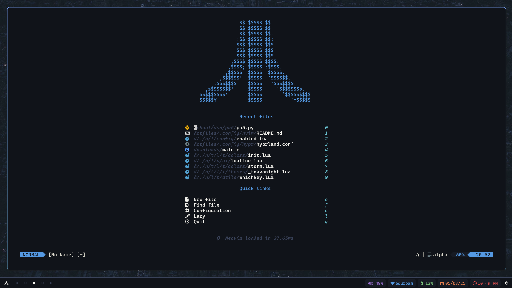

# No Place Like ~

A solid collection of dotfiles to support my blazingly fast programming workflow




This dotfiles are built ontop of _Wayland_ and a properly setup _Hyprland_ configuration. Everything was tested on **Arch Linux**.

## Support For

- **Hyprland:** Customizable wayland compositor
- **Waybar:** A customizable navigation bar for wayland
- **Rofi:** Cool application launcher
- **Dunst:** Notification system
- **Kitty:** GPU Accelerated Terminal emulator
- **Neovim:** The best text editor
- **Tmux:** Terminal multiplexer
- **Zsh:** More capable shell (bash alternative)
- **Zathura:** Document viewer
- **Stow:** To manage the dotfiles

## Installation

All of these files are meant to be in the home directory:

```
cd ~
git clone --recursive https://github.com/JoshuaMarkle/dotfiles.git
```

This will create a `dotfiles` directory inside of `~`. Now, use `stow` to add symlinks:

```
cd ~/dotfiles
stow -t ~ -d ~/dotfiles -v .
```

When the zsh config is updated, dotfiles can be upated with command: `dots update`. (It will run the `stow` command above)

## Update Submodules

Use this command to update the sub-repos within the dotfiles:

```
git submodule update --init --recursive
```

## Things to Install

```
git neovim kitty tmux fzf zathura rofi-wayland
```

And you're all set! Enjoy :)
